# 🧠 RosterIQ — Memory-Driven Provider Roster Intelligence Agent

> **HiLabs Hackathon Submission** — A multi-agent, memory-driven intelligence system that diagnoses provider roster failures across file-level pipeline operations and market-level success metrics using episodic, procedural, and semantic memory.

---

## 📌 Table of Contents

- [Overview](#overview)
- [Architecture](#architecture)
- [Project Structure](#project-structure)
- [Memory System](#memory-system)
- [Agents](#agents)
- [Data Layer](#data-layer)
- [Tool Layer](#tool-layer)
- [Setup & Installation](#setup--installation)
- [Running the App](#running-the-app)
- [Example Queries](#example-queries)
- [Hackathon Requirement Mapping](#hackathon-requirement-mapping)
- [Bonus Features](#bonus-features)

---

## Overview

RosterIQ is a **memory-driven multi-agent intelligence system** that combines:

- Persistent **episodic, procedural, and semantic memory**
- **CSV analytics** over healthcare roster pipeline data
- **Root-cause reasoning** chained from evidence signals
- **Web context** enrichment via Tavily (regulatory/compliance)
- **Dynamic Plotly visualizations** and structured health reports
- A conversational **Streamlit UI**

It answers natural language questions like:

- _"Why did Kansas SCS% drop last month?"_
- _"Have we investigated this before?"_
- _"Triage stuck roster operations in Colorado."_
- _"Run a record quality audit for all MA files."_

---

## Architecture



---

## Project Structure

```
rosterIQ/
├── agents/
│   ├── supervisor_agent.py       # Intent routing, scope extraction, memory trigger
│   ├── planner_agent.py          # Converts brief → ordered diagnostic plan
│   ├── pipeline_health_agent.py  # Stage diagnostics, stuck RO detection
│   ├── record_quality_agent.py   # Market metrics, SCS trends, failure patterns
│   └── answer_agent.py           # Final synthesis, LLM response, charts, report
│
├── engines/
│   ├── root_cause_engine.py      # Chains evidence → likely operational cause
│   ├── monitoring_engine.py      # Proactive anomaly monitoring
│   └── procedure_runner.py       # Executes named YAML workflows
│
├── memory/
│   ├── episodic_memory.py        # SQLite + FAISS for past investigations
│   ├── procedural_memory.py      # YAML-backed updatable workflows
│   ├── semantic_memory.py        # JSON + FAISS domain knowledge
│   ├── episodic_memory_store.db  # Persistent SQLite store
│   ├── episodic_memory.index     # FAISS retrieval index
│   └── semantic_memory.index     # FAISS retrieval index
│
├── tools/
│   ├── data_query_tool.py        # CSV load, filter, join, anomaly detection
│   ├── visualization_tool.py     # 6 Plotly chart types
│   ├── report_generator.py       # Structured health report
│   └── web_search_tool.py        # Tavily / offline fallback
│
├── graph/
│   └── agent_graph.py            # LangGraph multi-step pipeline
│
├── procedures/
│   └── procedures.yaml           # Named workflow registry
│
├── utils/
│   └── openrouter_client.py      # LLM reasoning / reflection
│
├── data/
│   ├── roster_processing_details.csv        # File-level pipeline data
│   └── aggregated_operational_metrics.csv   # Market-level metrics
│
├── app/
│   └── streamlit_app.py          # Conversational UI
│
└── .env                          # API keys (see Setup)
```

---

## Memory System

### Episodic Memory

Stores past investigation sessions for longitudinal comparison.

| Property  | Detail |
|-----------|--------|
| Storage   | SQLite (`memory/episodic_memory_store.db`) |
| Retrieval | FAISS vector index (`memory/episodic_memory.index`) |
| Fields    | query, response, metadata, tags, reflection, what-worked, what-to-avoid |
| Used by   | `SupervisorAgent` (prior-investigation check), `AnswerAgent` (past vs current) |

### Procedural Memory

Stores named, editable diagnostic workflows.

| Property         | Detail |
|------------------|--------|
| Storage          | YAML (`procedures/procedures.yaml`) |
| Built-in procedures | `triage_stuck_ros`, `record_quality_audit`, `market_health_report`, `retry_effectiveness_analysis`, `lob_rejection_breakdown` |
| Updates          | `upsert_from_query()` and `improve()` — user-driven via natural language |
| Used by          | `PlannerAgent`, `ProcedureRunner`, `AnswerAgent` |

### Semantic Memory

Stores domain knowledge for explainable, domain-aware reasoning.

| Property  | Detail |
|-----------|--------|
| Storage   | JSON (`memory/semantic_memory_store.json`) |
| Retrieval | FAISS vector index (`memory/semantic_memory.index`) |
| Contains  | Pipeline stage definitions, health flag semantics, roster terminology, metric glossary |
| Used by   | `AnswerAgent` for domain-grounded explanations |

---

## Agents

### SupervisorAgent

- Entry point for every query
- Detects: market, organization, time scope, chart type, memory intent, procedure intent, web-search need
- Pulls episodic memory for prior-investigation queries
- Builds the **investigation brief** passed to all downstream agents

### PlannerAgent

- Converts the investigation brief into an ordered list of procedures
- Routes to reusable YAML workflows instead of ad hoc logic
- Respects `is_procedure_update` and `is_procedure_execution` flags

### PipelineHealthAgent

- Analyzes `roster_processing_details.csv`
- Produces: stuck RO counts, dominant pipeline stages, duration anomalies

### RecordQualityAgent

- Analyzes both CSVs
- Produces: SCS_PERCENT trend, failure status breakdown, top impacted organizations, market metrics

### ProcedureRunner

- Executes named procedures from procedural memory
- Handles cross-table diagnostics, retry analysis, scoped audits

### RootCauseEngine

- Chains evidence into an operational root cause:
  - Dominant pipeline stage
  - Top failure status
  - Top impacted organization
  - Stuck inventory count

### AnswerAgent

- Final synthesis layer
- Combines: memory context, procedure results, pipeline evidence, market metrics, semantic hints, web context
- Calls OpenRouter LLM for natural language generation
- Builds Plotly charts and structured reports
- Stores final investigation back into episodic memory

---

## Data Layer

Two source CSVs are loaded and analyzed by `DataQueryTool`:

| File | Description |
|------|-------------|
| `roster_processing_details.csv` | File-level pipeline data (RO_ID, ORG_NM, LATEST_STAGE_NM, IS_STUCK, FAIL_REC_CNT, SCS_PCT, FAILURE_STATUS, …) |
| `aggregated_operational_metrics.csv` | Market-level monthly metrics (MARKET, MONTH, SCS_PERCENT, OVERALL_SCS_CNT, OVERALL_FAIL_CNT, …) |

**DataQueryTool capabilities:**

- Load and filter both CSVs by market, org, scope
- Infer market/org from free text
- State-period join for cross-table analysis
- Rejection anomaly detection
- Stage duration anomaly detection
- Retry effectiveness analysis

---

## Tool Layer

| Tool | File | Description |
|------|------|-------------|
| VisualizationTool | `tools/visualization_tool.py` | 6 Plotly charts (see below) |
| ReportGenerator | `tools/report_generator.py` | Structured pipeline & quality health report |
| WebSearchTool | `tools/web_search_tool.py` | Tavily search or offline fallback |
| OpenRouterClient | `utils/openrouter_client.py` | LLM routing, reflection, response generation |

### Available Charts

| Chart | Key |
|-------|-----|
| Pipeline stage health heatmap | `pipeline_stage_health_heatmap` |
| Record quality breakdown | `record_quality_breakdown` |
| Duration anomaly chart | `duration_anomaly_chart` |
| Market SCS% trend | `market_scs_percent_trend` |
| Retry lift chart | `retry_lift_chart` |
| Stuck RO tracker | `stuck_ro_tracker` |

---

## Setup & Installation

### 1. Clone and install dependencies

```bash
git clone https://github.com/AryanPant/RosterIQ-Intelligence-Agent/
cd rosterIQ
pip install -r requirements.txt
```

### 2. Configure environment variables

Create a `.env` file in the `rosterIQ/` directory:

```env
OPENROUTER_API_KEY=your_openrouter_api_key
TAVILY_API_KEY=your_tavily_api_key        # optional — falls back to offline
OPENROUTER_MODEL=openai/gpt-4o-mini       # or any OpenRouter-supported model
```

### 3. Verify data files

Ensure both CSVs are present in the `data/` directory:

```
rosterIQ/data/roster_processing_details.csv
rosterIQ/data/aggregated_operational_metrics.csv
```

---

## Running the App

### Streamlit UI (recommended)

```bash
cd rosterIQ
streamlit run app/streamlit_app.py
```

### CLI / Direct pipeline

```bash
cd rosterIQ
python -c "
from graph.agent_graph import run_pipeline
result = run_pipeline('Why did Kansas SCS% drop last month?')
print(result['response'])
"
```

---

## Example Queries

| Query Type | Example |
|------------|---------|
| Market trend | _"Why did Kansas SCS% drop last month?"_ |
| Pipeline triage | _"Show me stuck roster operations in Colorado."_ |
| Record quality | _"Run a record quality audit for all MA files."_ |
| Memory lookup | _"Have we investigated a Kansas rejection spike before?"_ |
| Procedure update | _"Update record_quality_audit to flag files below 80%."_ |
| Root cause | _"What is causing the validation failures in Ohio?"_ |
| Full report | _"Give me a full operational report across all states."_ |
| Visualization | _"Plot the SCS% trend for all markets."_ |
| Web context | _"What CMS compliance requirements apply to provider roster submissions?"_ |

---

## Hackathon Requirement Mapping

| Requirement | Implementation |
|-------------|----------------|
| Episodic memory | `EpisodicMemory` — SQLite + FAISS persistence |
| Procedural memory | `ProceduralMemory` — YAML registry + user-editable |
| Semantic memory | `SemanticMemory` — JSON store + FAISS |
| Cross-table analysis | `DataQueryTool.correlate_state_period_metrics()` |
| Visualization | `VisualizationTool` — 6 Plotly chart types |
| Web search | `WebSearchTool` — Tavily / offline fallback |
| Report generation | `ReportGenerator.generate()` |
| Multi-step reasoning | LangGraph pipeline — `graph/agent_graph.py` |
| Multi-agent (bonus) | Supervisor + 4 specialist agents |

---

## Bonus Features

### Root-Cause Chaining

`engines/root_cause_engine.py` — chains multiple weak signals (stage concentration + failure status + org impact + stuck count) into a prioritized root cause, rather than reporting them independently.

### Feedback-Driven Procedural Learning

Users can refine procedures in natural language:

> _"Update record_quality_audit to use 80% threshold instead of 85%."_

RosterIQ parses the instruction via LLM, persists the updated YAML, and immediately re-executes the procedure to validate the new logic — closing the human-in-the-loop feedback cycle.
